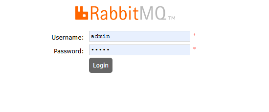
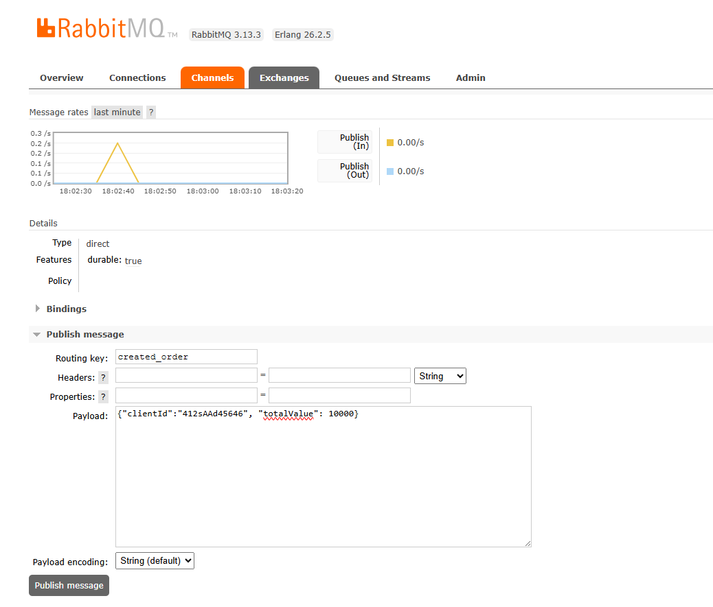

# 💬 Desafio backend BTG Pactual

## ✳️ Sobre
O **Desafio backend BTG Pactual** é um desafio backend feito pela instituição.

---

## 🛠 Ferramentas Utilizadas
- [Node](https://nodejs.dev)
- [Express](https://expressjs.com/pt-br/)
- [Mysql](https://www.mysql.com/)
- [Prisma](https://www.prisma.io/)
- [Jest](https://jestjs.io)
---

## 💻 Clonando o repositório

- Clone o projeto

  ```bash
  git clone https://github.com/filipedev040990/desafio-btg-pactual-backend
  ````
---

## 🏠 Adicionando variáveis de ambiente (.env)
Existe o arquivo `.env.example` com todas as variáveis utilizadas para rodar o sistema. Faça uma cópia desse arquivo e renomeie a cópia para `.env` antes de executar o comando para iniciar a aplicação.

---

## ▶️ Executando o projeto
- Execute o seguinte comando.
  ```bash
    docker compose up -d
  ```

- Utilize o comandos abaixo para verificar se os containers (order, rabbitmq, database) estão todos rodando.
  ```bash
    docker ps --format "table {{.ID}}\t{{.Names}}\t{{.Status}}\t{{.Ports}}"
  ```

- Utilize o comandos abaixo para acompanhar os logs do serviço order.
  ```bash
    docker logs -f order
  ```
---


## Dependências para a execução
Basta ter o docker instalado em sua máquina para executar os containers.

## 🐰 RabbitMQ
Você pode acessar o console de administração pelo endereço [http://localhost:15672](http://localhost:15672).
Os dados de acesso são os que você definiu no seu arquivo `.env`.



## Publicando mensagem no rabbitmq 🐰
Após acessar o console, acesse o menu `Exchanges` e encontre a exchange chamada `orders` e clique nela.
Agora expanda o menu `Publish message`e preencha o campo `routing_key`com `created_order` e um payload conforme exemplo:



Após publicar a mensagem nesta `exchange`, a mesma será encaminhada para as filas que possuírem um bind com ela.

---

## 🧩 Swagger
É possível acessar a documentação da API pelo [Swagger da API](http://localhost:3000/api-docs) e simular os endpoints

---

## 🧪 Testes:
- Rodar todos os testes
  ```bash
  npm t
  ```
---

## 🚀 Commits no projeto

O projeto possui [husky](https://github.com/typicode/husky) para verificar alguns passos antes de autorizar o commit.

1. Aplicar correções relacionadas à **Lint**;
3. Validação da mensagem de commit conforme as regras do [conventional-commits](https://www.conventionalcommits.org/en/v1.0.0/);
  - Padrão no desenvolvimento de um card:
  > tipo(#numero_do_card): descrição em inglês (em letras minúsculas)
  - Padrão de desenvolvimento não relacionado a cards
  > tipo(escopo): descrição em inglês (em letras minúsculas)

Exemplos de tipos:
  - feat: introduz uma nova funcionalidade à base de código;
  - fix: correção de um bug na base de código;
  - build: Introduz uma mudança que afeta o build do sistema ou alguma dependência externa (exemplos de escopos: gulp, broccoli, npm);
  - chore: atualização de ferramentas, configurações e bibliotecas
  - ci: Introduz uma mudança aos arquivos e scripts de configuração do CI/CD (exemplos de escopos: Travis, Circle, BrowserStack, SauceLabs)
  - docs: Alterações na documentação
  - style: Introduz uma mudança que não afeta o significado do código (remoção de espaços em branco, formatação, ponto e virgula faltando, etc)
  - refactor: Uma mudança no código que nem corrige um bug nem adiciona uma nova funcionalidade
  - perf: Um mundança no código que melhora a performance
  - test: Adicionar testes faltando ou corrigir testes existentes

Exemplos de commits válidos:
  ```bash
  git commit -m "feat(#300): creating auth service"
  git commit -m "fix(#30): correcting product type"
  git commit -m "style(lint): removing some lint warnings"
  git commit -m "docs(readme): removing deploy section from readme"
  ```
---